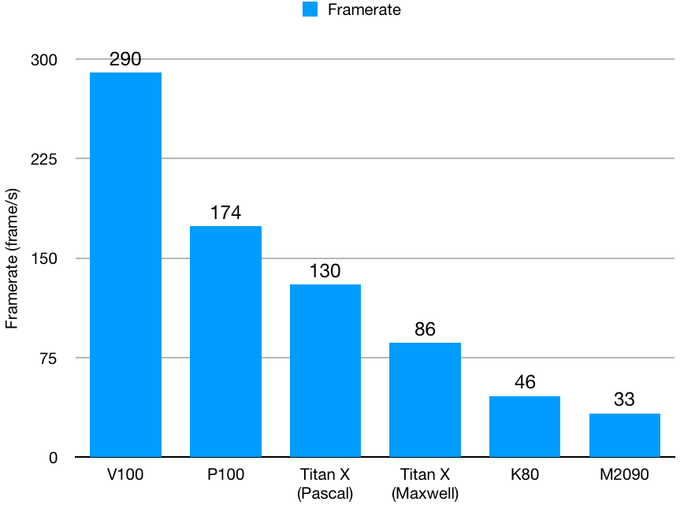

# What is COMPASS ?
The COMPASS platform was designed to meet the need of high-performance for the simulation of AO systems. The final product includes a software package for simulating all the critical subcomponents of AO, particularly in the context of the ELT and a real-time core based on several control approaches, with performances consistent with its integration into an instrument. Taking advantage of the specific hardware architecture of the GPU, the COMPASS tool allows to achieve adequate execution speeds to conduct large simulation campaigns caled to the ELT.
The COMPASS platform can be used to carry a wide variety of simulations to
both test specific components of AO of the E-ELT (such as wavefront analysis
device with a pyramid or elongated Laser star), and various systems
configurations such as multi-conjugate AO.
# Get started
COMPASS is available on GitHub for Linux platform only, equiped with a Nvidia GPU card.
```markdown
git clone https://github.com/ANR-COMPASS/compass.git
```
Follow the [installation instructions](Install.md) to get all the dependencies.
The user manual is available here (soon)

# Main features
## Models
COMPASS simulates atmosphere disturbance, telescope pupil, WFS, DM and RTC. The output is the long exposure PSF.
### Telescope
- ELT pupil {:height="200px" width="200px" float="right"}.
- Phase aberration,, NCPA

### Atmosphere
- User defined number of independent turbulent layers
- Kolmogorov or Von Karman spectrum
- Customizable r0, outer scale and profile

### WFS
- Shack-Hartmann WFS
- High resolution pyramid WFS {:height="200px" width="200px"}.
- LGS with cone effect and elongation
- "Geomtric" model : the average phase gradient at each sub-aperture, based on the phase itself

### DM
- piezo-stack type DM with multiple influence functions available
- tip-tilt mirror
- Karhunen-Loeve mirror
- Possibility to insert any custom DM in the simulation via HDF5 file

### RTC
- Multiple centroiding methods : CoG, thresholded CoG, brightest pixels, etc...
- Various wavefront reconstruction models : least-square, minimum variance, CuReD, phase projection, etc...

## User interface
COMPASS UI is coded in Python 3, allowing easy interactions with the simulation.

### GUI
A pyQtgraph based graphical interface is available

### Script
Object oriented programmation of COMPASS makes scripts of simulation light and easy to write.
```python
from docopt import docopt
import shesha_sim
arguments = docopt(__doc__)
param_file = arguments["<parameters_filename>"]
sim = shesha_sim.Simulator(param_file)
sim.init_sim()
sim.loop(sim.config.p_loop.niter)
```

# Performance
COMPASS computing performance is scalable according to the Nvidia GPU card used. A speed up of 9 has been reached with the last Nvidia V100 GPU compared to the project start's state of the art GPU, without changing a single line of code. Performance will continue to evolve with next GPU generations. Here is the evolution measured on a SCAO ELT scale.
{: float="left"}.
