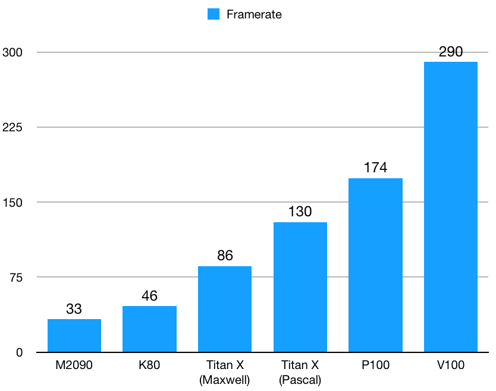
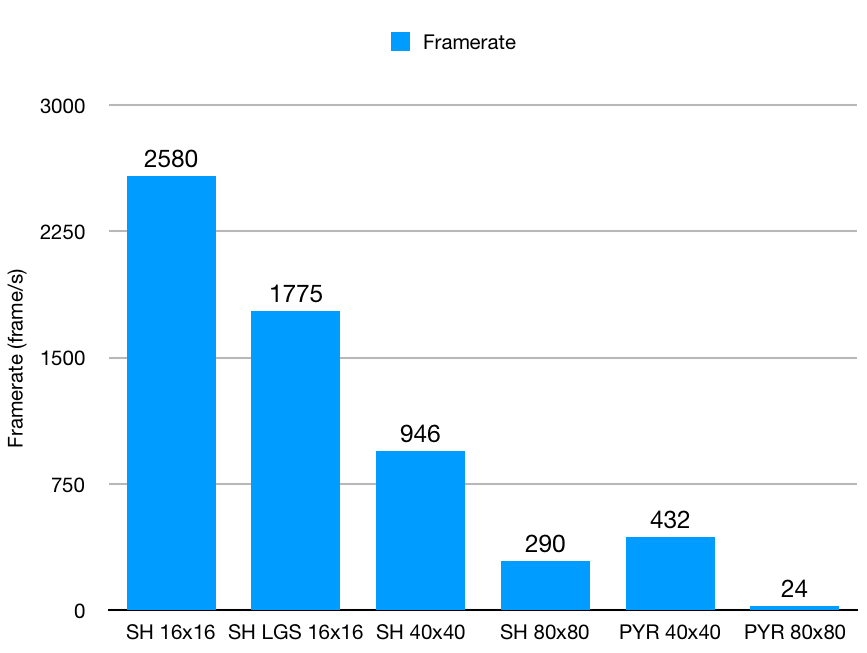
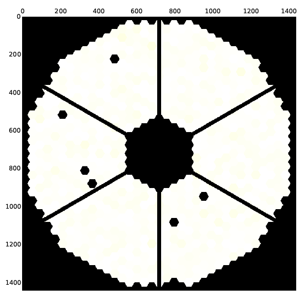
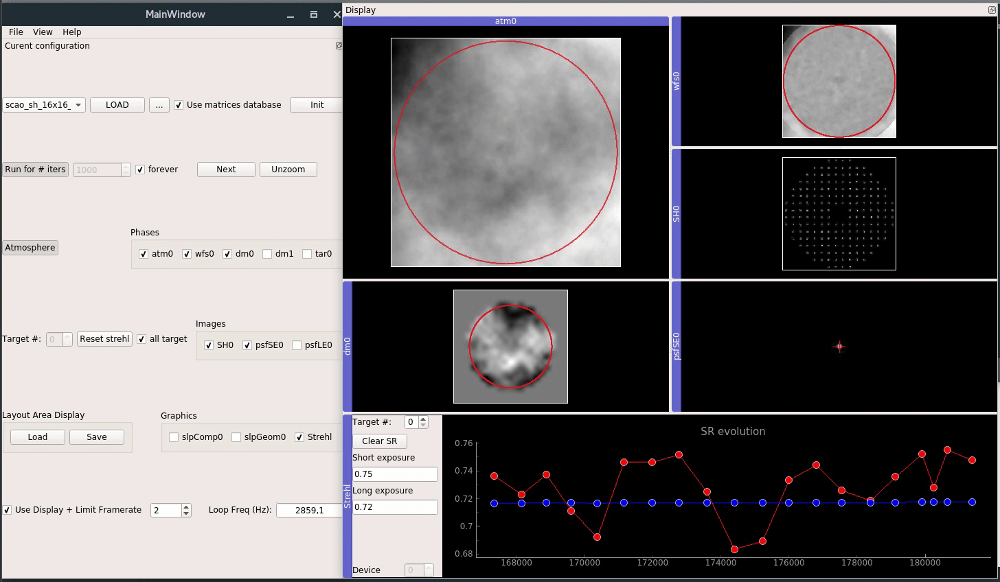

# COMPASS

## What is COMPASS?

The COMPASS platform was designed to meet the need of high-performance for the simulation of AO systems. The final product includes a software package for simulating all the critical subcomponents of AO, particularly in the context of the ELT and a real-time core based on several control approaches, with performances consistent with its integration into an instrument. Taking advantage of the specific hardware architecture of the GPU, the COMPASS tool allows to achieve adequate execution speeds to conduct large simulation campaigns caled to the ELT.
The COMPASS platform can be used to carry a wide variety of simulations to
both test specific components of AO of the E-ELT (such as wavefront analysis
device with a pyramid or elongated Laser star), and various systems
configurations such as multi-conjugate AO.

## Get started

COMPASS is available on [GitHub](https://github.com/ANR-COMPASS/shesha.git) for Linux platform only, equiped with a Nvidia GPU card.

Follow the [installation instructions](install.html) to get all the dependencies.
The [user manual](manual.html) is available.

**Please, check the News section to get informed of what's new on COMPASS and of important update.**

## Performance

COMPASS computing performance is scalable according to the Nvidia GPU card used. A speed up of 9 has been reached with the last Nvidia V100 GPU compared to the project start's state of the art GPU, without changing a single line of code. 

Current performance leads to around 1 kHz for a SPHERE scale, 300 Hz for a SCAO ELT scale. Performance will continue to evolve with next GPU generations. Here is the performance obtained with the current state of the art Nvidia's GPU V100 for various simulation scale and the evolution with GPU generation measured on a SCAO ELT scale.

{: height="auto" width="410px"}
{: height="auto" width="410px"}

## Main features

### Models

COMPASS simulates atmosphere disturbance, telescope pupil, WFS, DM and RTC. The output is the long exposure PSF.

#### Telescope 

<span class="inner">{:height="250px" width="250px" float=right}</span>

- Customizable spiders
- ELT pupil features including missing segments and reflectivity
- Phase aberration between segments including piston, tip and tilt 
- NCPA

#### Atmosphere

- User defined number of independent turbulent layers
- Kolmogorov or Von Karman spectrum
- Customizable r0, outer scale and profile

#### WFS

<span class="inner">{:height="250px" width="250px"}</span>

- Customizable spiders
- Shack-Hartmann WFS
- High resolution pyramid WFS 
- LGS with cone effect and elongation
- "Geomtric" model : the average phase gradient at each sub-aperture, based on the phase itself

#### DM

- piezo-stack type DM with multiple influence functions available
- tip-tilt mirror
- Karhunen-Loeve mirror
- Possibility to insert any custom DM in the simulation via HDF5 file

#### RTC

- Multiple centroiding methods : CoG, thresholded CoG, brightest pixels, etc...
- Various wavefront reconstruction models : least-square, minimum variance, CuReD, phase projection, etc...

### User interface

COMPASS UI is coded in Python 3, allowing easy interactions with the simulation.

#### GUI

A pyQtgraph based graphical interface is available



#### Script

Object oriented programmation of COMPASS makes scripts of simulation light and easy to write.

```python
from shesha.sim.simulator import Simulator
arguments = docopt(__doc__)
param_file = "<parameters_filename>"
sim = Simulator(param_file)
sim.init_sim()
sim.loop(sim.config.p_loop.niter)
```
