# User manual
This is the user manual for COMPASS. We will try to be as exhaustive as possible, but if you don't get the answer you are looking for, [contact us on the GitHub project](https://github.com/anr-compass/shesha).

* blabla
{:toc}

## 1. Quick start

### 1. Basic simulation
To launch a basic simulation with COMPASS, you can use our script with a parameter file as an argument :
```bash
cd $SHESHA_ROOT
ipython -i test/closed_loop.py path_to_your_parfile/parfile.py
```
Some basic parameter files are provided in the directory ```$SHESHA_ROOT/data/par/par4bench``` and an example is provided [here](#2-parameter-file)

After an initialization phase, the script will prompt in the terminal the short exposure Strehl ratio, the long exposure one, an estimation time remaining and the mean framerate of the simulation :
```bash
----------------------------------------------------
| iter# | S.E. SR | L.E. SR | ETR (s) | Framerate (Hz) |
| ----- |
100 	 0.748 	  0.748	     1.3 	 683.2
200 	 0.733 	  0.740	     1.2 	 683.9
300 	 0.742 	  0.741	     1.0 	 683.9
400 	 0.724 	  0.737	     0.9 	 684.1
500 	 0.740 	  0.737	     0.7 	 684.1
600 	 0.789 	  0.746	     0.6 	 684.3
700 	 0.710 	  0.741	     0.4 	 684.3
800 	 0.743 	  0.741	     0.3 	 684.2
900 	 0.696 	  0.736	     0.1 	 684.2
1000 	 0.709 	  0.733	     0.0 	 684.2
 loop execution time: 1.4643762111663818   ( 1000 iterations),  0.0014643762111663818 (mean)   682.8846251220482 Hz
```

### 2. Parameter file
For COMPASS,  a parameter file is a python file where the parameter classes are instantiated and setted to be imported by the simulation script. All the parameter classes are described in details [here](#2-shesha_config-parameter-classes). 
To write your own paramater file, remember those important points :
- Starts by importing the ```shesha_config``` module: it contains all the parameter classes
- Instantiates the paramater classes you need for your simulation. **Note that some of those classes are required to perform a simulation : Param_loop, Param_geom, Param_tel and Param_atmos.** You also have to set a list of Param_wfs called ```p_wfss```, a list of Param_dm called ```p_dms```, a list of Param_centroider called ```p_centroiders``` and a list of Param_controller called ```p_controllers```.
- Set the classes parameters using the setter functions. Those functions are usually named as ```set_<parameter name>```. 

An example of parameter file follows and others can be found in ```$SHESHA_ROOT/data/par/par4bench``` directory
```python
import shesha_config as conf

simul_name = "scao_sh_40m_80_8pix"

# loop
p_loop = conf.Param_loop()

p_loop.set_niter(5000)
p_loop.set_ittime(0.002)  

# geom
p_geom = conf.Param_geom()

p_geom.set_zenithangle(0.)

# tel
p_tel = conf.Param_tel()

p_tel.set_diam(40.0)
p_tel.set_cobs(0.12)

# atmos
p_atmos = conf.Param_atmos()

p_atmos.set_r0(0.16)
p_atmos.set_nscreens(1)
p_atmos.set_frac([1.0])
p_atmos.set_alt([0.0])
p_atmos.set_windspeed([20.0])
p_atmos.set_winddir([45])
p_atmos.set_L0([1.e5])

# target
p_target = conf.Param_target()

p_target.set_ntargets(1)
p_target.set_xpos([0])
p_target.set_ypos([0.])
p_target.set_Lambda([1.65])
p_target.set_mag([10])

# wfs
p_wfs0 = conf.Param_wfs()
p_wfs1 = conf.Param_wfs()
p_wfss = [p_wfs0]

p_wfs0.set_type("sh")
p_wfs0.set_nxsub(80)
p_wfs0.set_npix(8)
p_wfs0.set_pixsize(0.3)
p_wfs0.set_fracsub(0.8)
p_wfs0.set_xpos(0.)
p_wfs0.set_ypos(0.)
p_wfs0.set_Lambda(0.5)
p_wfs0.set_gsmag(3.)
p_wfs0.set_optthroughput(0.5)
p_wfs0.set_zerop(1.e11)
p_wfs0.set_noise(-1)
p_wfs0.set_atmos_seen(1)

# dm
p_dm0 = conf.Param_dm()
p_dm1 = conf.Param_dm()
p_dms = [p_dm0, p_dm1]
p_dm0.set_type("pzt")
nact = p_wfs0.nxsub + 1
p_dm0.set_nact(nact)
p_dm0.set_alt(0.)
p_dm0.set_thresh(0.3)
p_dm0.set_coupling(0.2)
p_dm0.set_unitpervolt(0.01)
p_dm0.set_push4imat(100.)

p_dm1.set_type("tt")
p_dm1.set_alt(0.)
p_dm1.set_unitpervolt(0.0005)
p_dm1.set_push4imat(10.)

# centroiders
p_centroider0 = conf.Param_centroider()
p_centroiders = [p_centroider0]

p_centroider0.set_nwfs(0)
p_centroider0.set_type("cog")

# controllers
p_controller0 = conf.Param_controller()
p_controllers = [p_controller0]

p_controller0.set_type("ls")
p_controller0.set_nwfs([0])
p_controller0.set_ndm([0, 1])
p_controller0.set_maxcond(1500)
p_controller0.set_delay(1)
p_controller0.set_gain(0.4)
```

###  3. Script
Thanks to the architecture of COMPASS, writing a script is easy. 

Let's take a look at our ```closed_loop.py``` script :
```python
import shesha_sim
from docopt import docopt
arguments = docopt(__doc__)
param_file = arguments["<parameters_filename>"]
sim = shesha_sim.Simulator(param_file)
sim.init_sim()
sim.loop(sim.config.p_loop.niter)
```
Let's go step-by-step :
- The first line imports the ```shesha_sim``` module: it contains the Simulator class used to perform the simulation. This class is described properly [here](#3-shesha_sim-simulator-class).
- The next lines : 
```python
from docopt import docopt
arguments = docopt(__doc__)
param_file = arguments["<parameters_filename>"]
```
are used to get the parameter file name. ```docopt``` module is a command line arguments parser for python that can also set proper usage pattern and options for your script. For more information, visit [docopt.org](http://docopt.org/)
- ```sim = shesha_sim.Simulator(param_file)``` instantiates the Simulator class and loads the parameters define in the parameter file
- ```sim.init_sim()``` initializes the simulation.
- ```sim.loop(sim.config.p_loop.niter)``` runs the simulation for ```niter``` iterations

### 4. Interactions
If you had launched your script with python or ipython in interaction mode (```-i``` option), you will have access to the prompt after the iterations loop. At this point, you can interact with your simulation to display images (PSF, command matrix...) or to access at any internal quantity for debug. You can also modify your simulation and launch new iterations.

Remember that your Simulator instance ```sim``` has created objects and you can access to them:
- ```sim.config``` contains all the simulation parameters imported from your parameter file
- ```sim.tel``` is the telescope object
- ```sim.atm``` is the atmosphere object
- ```sim.wfs``` is the wavefront sensor object. It could contain several WFS depending on your parameter file
- ```sim.tar``` is the target object
- ```sim.dms``` is the DM object. It could contain several DM depending on your parameter file
- ```sim.rtc``` is the RTC object. It contains the centroiders and the controller that you have defined in the parameter file

All those objects have getter and setter methods which you can use to get information on what is going on your simulation or to set new parameters.

Some of the most useful methods are listed below:

| Method                         | Description                                                                 |
| :----------------------------- | :-------------------------------------------------------------------------- |
| **sim.tar.get_image(0,b"le")** | Return the long exposure PSF. Use ```b"se"``` to get the short exposure one |
| **sim.tar.get_phase(0)**       | Return the residual phase                                                   |
| **sim.wfs.get_binimg(0)**      | Return the SH WFS spots image                                               |
| **sim.wfs.get_pyrimg(0)**      | Return the pyramid WFS image                                                |
| **sim.dms.get_dm(b"pzt",0)**   | Return the DM shape                                                         |
| **sim.rtc.get_centroids(0)**   | Return the lastest centroids (X measurements first, then Y)                 |
| **sim.rtc.get_com(0)**         | Return the lastest DM commands                                              |
| **sim.rtc.get_imat(0)**        | Return the interaction matrix                                               |
| **sim.rtc.get_cmat(0)**        | Return the command matrix                                                   |

You can find all the methods description and usage in the [shesha package documentation](http://shesha.readthedocs.io/), autogenerated from the source code documentation using Sphinx. You can also use the ```help``` command of python to get information about a method.

### 5. Using the GUI

#### Basic mode
To launch the GUI :
```
ipython -i $SHESHA_ROOT/widgets/widget_ao.py
```
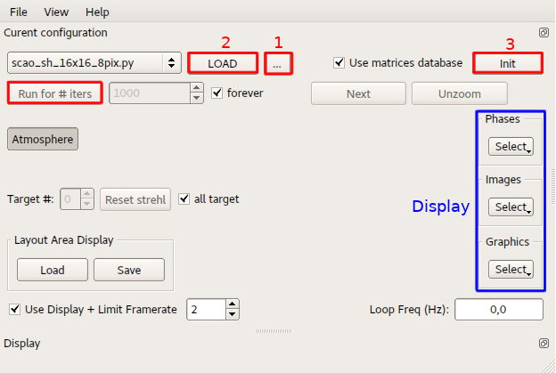{:width="600px"}

To start your simulation, follows those steps:

- **Step 1**: Browse to your parameter file using the button next to the Load button
- **Step 2**: Load the parameters by cliking the *Load* button
- **Step 3**: Initialize the simulation by clicking the *Init* button. The initialization phase is finished once the *Init* button is available again. Note that you can follow the process in the terminal.
- **Step 4**: Run your simulation with the *Run* button. By default, it will run infinite iterations. You can stop it by clicking again the button. You can also select a specific number of iterations to run. To do so, uncheck the *forever* button and enter the number of iterations you want in the text box. The *Next* button performs only one iteration.

#### Display management
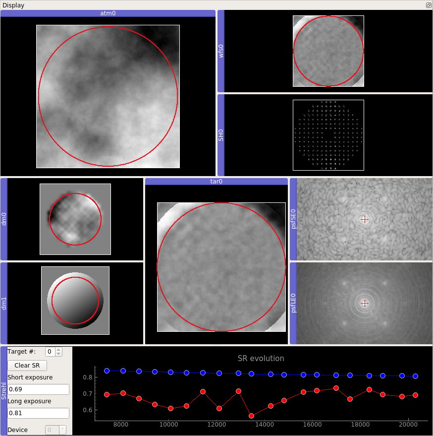{:width="600px"}

By default, nothing is displayed when you launched the simulation. You can choose what to display by cheking the corresponding boxes in the drop down menus. Then, you can rearrange the displays as you wish by drag and drop. You can also detach the display area from the main window by clicking the button in the bottom right corner of the main window.

You have also the possibility to save your layout area disposition. Once you have organized your display area, press the *Save* button of the *Layout Area Display*. You will be able to load it for further simulations with the *Load* button.

#### Expert mode
An additional panel is available via the option ```--expert``` that allows to control the simulation on the fly.
To use it, launch the GUI with the option : 
```
ipython -i $SHESHA_ROOT/widgets/widget_ao.py -- --expert
```
or : 
```
python -i $SHESHA_ROOT/widgets/widget_ao.py --expert
```
if you don't use ipython.
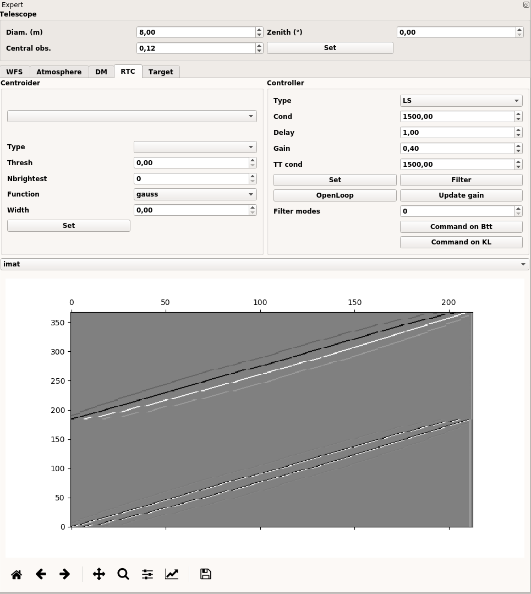{:width="600px"}
This panel displays the simulation parameters currently used. Those parameters can be changed manually in the GUI before the initialization : enter the new parameter value and press the corresponding *Set* button. All the *Update* button can be used to change parameters on the fly, without restarting the simulation. For example, it is possible to change the loop gain at any time.

#### Interactions in the terminal
The terminal is also available when you are using the GUI, as for a classical simulation. All the commands listed in the section [Interactions](#4-interactions) (and all the other) remain valids, but you have to add ```wao.``` before each command. For example, ```sim.tar.get_image(0,b'le')``` becomes ```wao.sim.tar.get_image(0,b'le')```

## 2. Features implementation

### 1. Random number generation
COMPASS requires the generation of several sets of random numbers which are used for : 
- turbulent phase generation
-  WFS image generation
https://anr-compass.github.io/compass/2018/01/22/debugs.html
In both cases a pseudo random number generator (PRNG), of the Mersenne Twister family which generates 64 distinct sequences based on different parameter sets for the basic algorithm, is used. More details can be found in the [cuRAND library documentation](http://docs.nvidia.com/cuda/curand/host-api-overview.html) (see details on the MTGP32 generator).

Several sets of random numbers are generated following a Normal distribution to be used in the two above mentioned subsystems. In the case of the simulation of noise for the WFS, an additional set of random numbers is generated following a Poisson distribution, using the raw WFS image to simulate for photon noise. This function returns a set of Poisson-distributed unsigned integers based on a Poisson distribution with the given set of lambda values (i.e. intensities in the image model). It relies on Knuth’s algorithm when the parameter lambda is less than 64, and uses a normal approximation when lambda is greater than 4000. In between 64 and 400, it uses a rejection algorithm based on the [incomplete gamma function approximation](https://people.maths.ox.ac.uk/gilesm/codes/poissinv/paper.pdf)

### 2. Quantum pixels and size of the simulation arrays

A critical parameter in the simulation model is the quantum pixel size. It is the size (expressed in arcsec) of the smallest turbulence cell that can produce a significant optical path difference between two rays of the light beam. It defines how the turbulent phase is sampled in the simulation and put constraints on the size of the largest arrays in the simulation. In COMPASS, the quantum pixel size is computed differently for Shack Hartmann and Pyramid WFS. Concerning the SH WFS, the sampling of the phase in a subaperture is computed as the ratio between the seeing obtained from the Fried parameter at the wavefront sensing wavelength, and the diffraction limit obtained using the physical subaperture diameter (subapdiahttps://anr-compass.github.io/compass/2018/01/22/debugs.htmlm). An arbitrary factor in then chosen to determine the final field of view simulated for a subaperture. To ensure that the final image in a subaperture contains most of the speckles of the spot image, we chose a constant value for this arbitrary k factor in our simulation (k=6) and the initial size of the square array containing the phase for a given subaperture is computed as :

```pdiam = long(k * subapdiam / r0)```

This number is then slightly tweaked in order to :
- use an integer rebin factor to downsample the high resolution image for a subaperture to the actual pixel size requested by the user
- an adequate array size (Nfft) for optimizing the performance of Fast Fourier Transforms on these high resolution images, assuming Nyquist sampling

The quantum pixel size is then estimated as :

```qpixsize = pdiam * lambda / subapdiam * RASC / Nfft```

where lambda is the observing wavelength of the WFS and RASC is the conversion factor between radians and arcsec. In this case, the size of the turbulent phase screen array to be simulated is

```nphase = pdiam*Nssp```

with Nssp the number of subapertures in the telescope diameter.

Concerning the pyramid WFS, the sampling of the phase is chosen as a trade-off between  several parameters. Similarly to the case of a single subaperture of the SH WFS, we should ensure a good sampling of the turbulence and avoid speckle aliasing in the final image. Hence, P, the pupil diameter (in pixels), i.e. the size of turbulent phase screen array to be simulated, should be larger than several times the ratio between the seeing and the diffraction limit, but this time for the whole telescope aperture.

```P > long(D / r0 * m)```

with m an integer factor similar to the k factor in the case of the SH WFS and D the diameter of the telescope.

Additionally, in the case of the pyramid, an ideal field stop radius is given by :

```Fs = lambda / D . Nssp / 2```

with Nssp the number of pyramid measurement points along the diameter of the pupil. The radius of the simulated field of view, is given by :

```Rf = Fs . N . D / lambda / P```

where N is the size of Fourier transform support of the high resolution image. N should is usually chosen to optimize the execution of the FFT algorithm (power of 2). 
Finally, we need to avoid as much as possible the overlap of diffractions effects from the 4 pupil images, which is linked to the pyramid angle, and leave enough room between the centers of these pupil images on the final high resolution image. Hence :

```Nfft > P*(2 + 3S)```

with S close to 1. To ease computation we also chose Nssp as a divisor of P. In this case, the scaling factor between the high resolution pupil images in pyramid model and actual pupil size on the camera images would be P / Nssp.

The quantum pixel size in arcsec is given by:
 
```qpixsize = pdiam * Lambda / D * RASC / Nfft```

### 3. Telescope
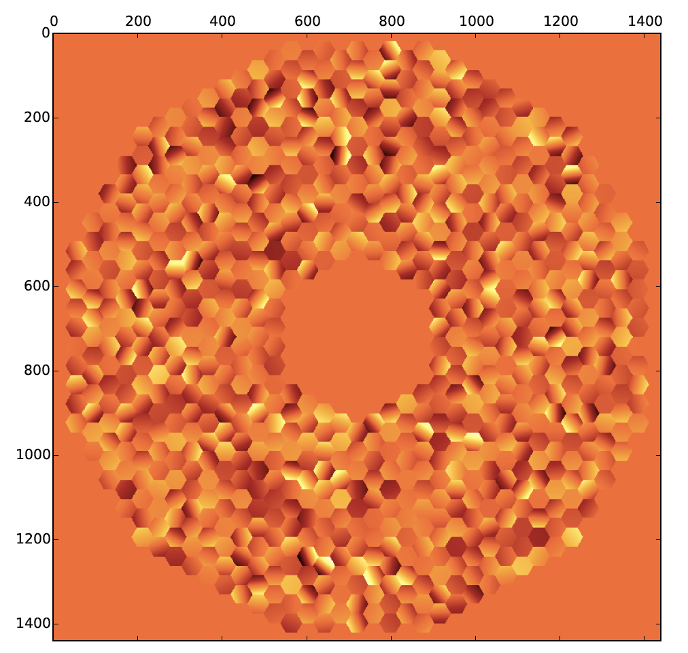{:height="300px"}
COMPASS includes the ability to use customizable telescope pupil: the diameter and the eventual central obstruction are parameters of the simulation. ELT and VLT pupils have been also implemented, including spiders, hexagonal segments, and missing segments. Phase aberration due to misalignment of the pupil segments are also configurable by specifying the amount of piston and tip-tilt errors. Reflectivity error between each segment can also be taken into account.

### 4. Atmosphere
Turbulence is generated on-the-fly during the iterations of the simulation by [the extrusion of Kolmogorov or Von Karman type phase screens](https://www.osapublishing.org/oe/abstract.cfm?id=87803). It is possible to simulate several independent turbulent layers at any set of user-defined altitudes. Each layer has its own arbitrary Fried parameter r0, outer scale values L0, wind speed and direction. The assumption is that the overall turbulence will result from the addition of the phase of these discrete, statistically independent layers, through an appropriate ray-tracing algorithm through each of them taking into account the direction of observation of each WFS and target object. Those phase screens are expressed in terms of optical path difference, in microns.

### 5. Shack-Hartmann WFS
COMPASS includes a Shack-Hartmann wave-front sensor model based on Fast Fourier Transforms (FFT) of the portion of the complex amplitude of the wave-front seen by each subaperture. This wave-front is computed by raytracing the turbulent layer and/or the DM shape in the guide star (GS) direction. The number of subapertures, the number of pixels per subaperture and the pixel size are specified by the user.

A special care has been brought on the sampling of the wave-front and on the support of the FFT in order to ensure a proper sampling of the PSF, together with an adequate field of view (set to at least 6 times larger than the seeing value) to include most of the speckles. The seeing is user-defined.

The sub-images are simulated at a high spatial resolution, binned to the WFS pixel size, then cropped to match the required field of view. Detector read-out noise and photon noise are simulated using random numbers generation, respectively following Normal and Poisson distributions. The standard deviations of those distributions depend respectively on the read-out noise and on the number of photons per subapertures, both defined by the user through dedicated parameters. The number of photons per subapertures is computed as:

```Nphotons = F0 * 10**(-0.4*m) * dt * T * S```

where:	
- F0 is the flux at magnitude 0, expressed in photons/m2/s	
- M is the guide star magnitude
- dt is the loop iteration time
- T is the optical throughput 	
- S is the subaperture surface in m²

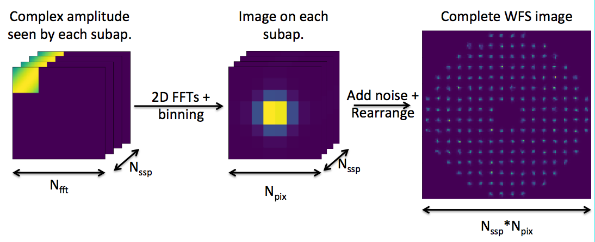{:width="500px"}
Each of those parameters are user-defined. The generation of the noise can be switched on or off on demand.
This model is called “diffractive”, as it results from a computation of Fraunhofer diffraction, using a Fourier transform.

#### Laser guide stars
Laser Guide Stars can be included in the simulation. It takes into account the sodium profile to compute elongation on each sub-aperture, and also the cone effect. 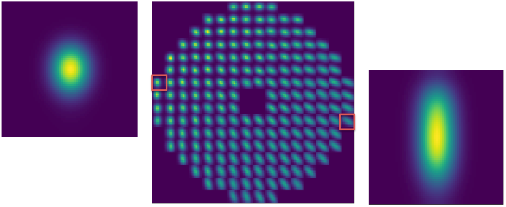{:width="500px"} Elongation is computed by convolving the high resolution image on each subaperture by a high resolution elongated spot model. This spot model is computed in respect with the sodium profile that could be analytical (Gaussian) or experimental (read from a file), and with each sub-apertures positions in relation to the laser launch position.

The cone effect, due to the finite height of the sodium layer where the LGS is produced, is taking into account in the simulation thanks to a GPU parallelized raytracing algorithm. For each pixel of the phase screen seen by the WFS, we calculate the sum of the corresponding pixels on each phase screen of the atmosphere layers. Each term is weighting by a the Cn² coefficient of its atmosphere layer. A linear interpolation is performed between the 4-near pixels of the atmosphere layer seen by the pixel of the WFS phase screen. Basically, this is equivalent to do a "zoom" on each phase screen and summing them.

Note that there isn't tip-tilt indetermination for LGS in COMPASS.

### 6. Pyramid WFS
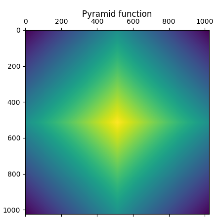{:width="300px"}
COMPASS features a pyramid wavefront sensor model based on the concept described in [Ragazzoni 1996](http://www.tandfonline.com/doi/abs/10.1080/09500349608232742). The PSF on the tip of the pyramid is obtained as the square modulus of the EM field in the pyramid plane. The latter is computed at high resolution as the Fourier transform of the EM field in the pupil plane for which the amplitude is given by the pupil intensity distribution and the phase is obtained as a combination of the actual residual phase from atmospheric disturbance (evaluated by raytracing through the turbulence and compensation from the DM) and the phase introduced by modulation.
The phase term introduced by the pyramid itself is added to this EM field and another Fourier Transform accounting for the relay lens, provides the EM field on the plane of the camera. 

Concerning the modulation, the corresponding Tip-Tilt term is introduced following regularly spaced distribution leading to a circular pattern around the tip of the pyramid. The 4 images of the pupil obtained at each modulation position as the square modulus of the EM field in the camera plane are stacked to form the final short exposure image on the WFS.

Proper undersampling to the users parameters and flux normalization are then performed. Photon and detector noise can then be added if specified.

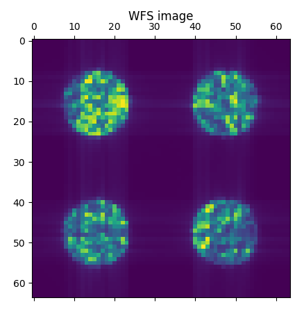{:width="420px"} 
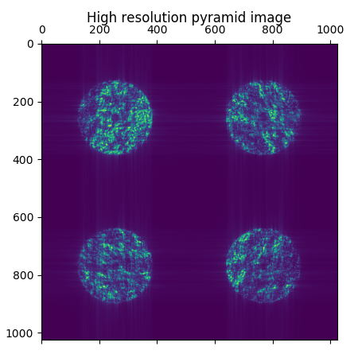{:width="420px"} 

Here a pseudo-code of the algorithm :
```
for each modulation point k:
      create phase_modu(k)
      get phase and multiply by exp(i*phase_modu) and by pupil amplitude
      do FFT
      apply field stop
      multiply by exp(i*pyramid_function)
      do IFFT
      do modulus square
      add to previous modulation image 
do FFT
Multiply by sinc (pixels transfer function) 
Rebin the image
Normalize
Add noise
```

### "Geometric" WFS
COMPASS also features a so-called “geometric model” emulating an ideal Shack-Hartmann wavefront sensor. This algorithm directly computes the average phase gradient at each subaperture, based on the phase itself, with no noise. This estimation of the average slope of the wavefront is considered as an “ideal” measurement, with perfect linearity over an infinite range and that does not suffer from any kind of sampling effect by a detector. This geometric model is embedded in all the WFS in COMPASS. Use the command ```sim.rtc.do_centroids_geom(0)``` to compute it.

Finally, a last level of abstraction is reached with the third type of wave surface analyzer, which is purely theoretical: it is a direct projection of the phase onto the DM influence functions, resulting in a set of DM voltages that best fit the wavefront in a least-square sense. It is fully linear and is free from any WFS effect or reconstruction effect, it is in particular free from aliasing. We call this method “DM projection”, it behaves as a theoretical, perfect WFS. To use it, set your controller type to "geo" : ```p_controllers[0].type = "geo"```

### 7. Deformable mirrors
COMPASS models the DM as a weighted sum of local influence functions. Several types of built-in influence functions are available, all of them close to a bell-shaped function. They have different analytical expressions, that fit different types of DMs. Each influence function is defined on a local support, chosen to be small with respect to the simulated pupil.

The model also allows the user to tune the width of the influence function, using a user-defined coupling factor between neighbouring actuators. The final DM shape is computed as the sum of the contribution of the influence functions, weighted by their voltage, at each point of the pupil. It is perfectly linear and does not include any kind of hysteresis or non-linearity. The actuators can be placed either across a rectangular, or an hexagonal grid, of selectable pitch.

The second type of DM is a so called tip-tilt mirror, which produces some pure tip and tilt over the pupil area.

Other type of DM is Karhunen-Loeve ones, which produces pure atmospherical Karhunen-Loeve modes.

COMPASS can handle any number of DMs, each of them conjugated at any arbitrary altitude. This parameter is taken into account during the ray-tracing step of the beams through the layers and the Dms.

#### Custom DM
It is also possible to use your own influence function. To do so, you have to provide a HDF5 file where you have saved your influence function and other informations on your DM in a [pandas DataFrame](https://pandas.pydata.org/pandas-docs/stable/generated/pandas.DataFrame.html) named ```"resAll"```. The simulation will then automatically resize and interpolate properly your influence functions. The needed informations in the dataFrame are listed below:

| Name        | Type                               | Unit                   | Description                                                                                                                                                                       |
| :---------- | :--------------------------------- | :--------------------- | :-------------------------------------------------------------------------------------------------------------------------------------------------------------------------------- |
| xpos        | np.array(ndim=1, dtype=np.float32) | meters                 | X positions of the actuators                                                                                                                                                      |
| ypos        | np.array(ndim=1, dtype=np.float32) | meters                 | Y positions of the actuators                                                                                                                                                      |
| center      | np.array(ndim=1, dtype=np.float32) | meters                 | 2-elements vector defining the origin of xpos and ypos in relation to the physical center of the DM                                                                               |
| res         | float                              | m/pix                  | Pixel resolution of your influence function                                                                                                                                       |
| dm_diam     | float                              | meters                 | DM diameter                                                                                                                                                                       |
| dm_diam_pup | float                              | meters                 | DM diameter projected in the pupil plane                                                                                                                                          |
| influ       | np.array(ndim=3,dtype=np.float32)  | Normalized deformation | Cube containing your influence functions. Cube size is (influ_size x influ_size x nactus). Influence functions must be ordered as the xpos and ypos vectors, and mormalized to 1. |

The names given here are arbitrary : you have to provide the actual names of those fields in the parameter file.

### 8. Centoiders

#### Classical centroiding
Several centroiding algorithms are implemented to compute the command to apply on the DM from the WFS image and can be selected on demand:	
- Center of gravity	
- Thresholded 	center of gravity
- Weighted center of gravity
- [Center of gravity on N brightest pixels](https://academic.oup.com/mnras/article/419/2/1628/989454)

The SH-WFS measurements is computed using those algorithms on each sub-apertures. For each sub-apertures, the centroid is computed on both X and Y-axis, leading to a measurement vector of size two times the number of sub-apertures. First half of this vector contains the X-measurements and the second half the Y ones.
The center of gravity on the X-axis is basically computed for each sub-aperture as:

``` Sx = sum(x * I(x)) / sum(I(x))```

where x is the pixel X-position and I(x) the intensity of the WFS image integrated along the Y-axis at this position. Other center of gravity algorithm are variants of this one, where a threshold or weights are applied before computation, or just considering the N brightest pixels in the computation. The output is the slopes vectors of size 2*Nssp: the first Nssp elements are the X-measurements and the other half contain the Y-measurement.

#### Correlation
The correlation algorithm requires a reference function to be correlated with the image. The reference function is computed through undersampling of a high resolution image of the spot in each subaperture obtained with no turbulence. Then the slope is estimated as the position of the maximum of the correlation function of the actual spot with turbulence and the reference function, for all subapertures. This position is determined at the sub-pixel level by performing a parabolic fit around the maximum.

#### Pyramid
In the case of the pyramid WFS, the slopes are computed following several approaches. The “local” approach is based on the original Ragazzoni paper, using the 4 corresponding pixels in pupil images : a, b, c and d:

``` Sx = (a + b) - (c + d) / (a + b + c + d)```

``` Sy = (a + c) - (b + d) / (a + b + c + d)```
expressed in arcsec using the modulation amplitude.

A modified version of this approach called “global” is also implemented, in which the intensity over the 4 corresponding pixels is replaced by the average intensity I0 in the pupil images.

``` Sx = (a + b) - (c + d) / I0```

``` Sy = (a + c) - (b + d) / I0```
which is also expressed in arcsec using the modulation amplitude.

On top of these two approaches, the user can also select to retrieve the actual phase gradient by using the sine function as described in [Verinaud 2004](http://www.sciencedirect.com/science/article/pii/S0030401804000628?via%3Dihub).

### 9. Controllers

#### Least-square approach
The control matrix R is computed via singular value decomposition and pseudo-inversion of the interaction matrix. This reconstruction is plugged in the temporal compensator, an integrator with gain. So, the command vector c at iteration k is computed as: 

```c[k] = c[k-1] - g * R * s[k]```

This approach can handle modal optimization as defined by [E. Gendron](https://hal.archives-ouvertes.fr/tel-01418424).

#### Minimum variance
The minimum variance reconstructor aims to minimize the variance of the difference between the estimated phase and the real one. If the statistical variables are gaussian, this is equivalent to a Maximum A Priori (MAP) approach where we want to maximize the probability of obtaining such measures knowing the phase. By solving this problem, the reconstructor can be written as : 

R = C&phi; * Dt * (D*C&phi;*Dt + Cn)^(-1)

where C&phi; is the phase covariance matrix, D is the DM interaction matrix (Dt is its transpose) and Cn the noise matrix.

Considering that Dt*C&phi;*D is equivalent to the measurements covariance matrix Cmm, we can rewrite the reconstructor as : 

R = C&phi;m * Cmm^(-1)

where C&phi;m is a covariance matrix between the phase and the DM actuators

C&phi;m and Cmm are computed from the same way described by [Eric Gendron et al.](https://www.spiedigitallibrary.org/conference-proceedings-of-spie/9148/1/A-novel-fast-and-accurate-pseudo-analytical-simulation-approach-for/10.1117/12.2055911.short?SSO=1)
Then, the reconstructor allows to compute the command matrix and the DM commands are computed thanks to Pseudo-Open Loop Control equations using the interaction matrix and previous commands to estimate open loop measurements from the closed loop one.

#### CuReD

COMPASS also includes an implementation of the CuReD wavefront reconstruction. Find more information in [M. Rosensteiner paper](https://www.osapublishing.org/josaa/abstract.cfm?uri=josaa-29-11-2328).

#### Direct projection

A perfect behaviour of your AO system can also being simulated thanks to a direct projection of the input phase on the DM actuators : 

c[k] = P.&Phi;

The projection matrix P is computed from the DM influence functions IF : 

P = (IFt IF)^(-1) IFt

and filtered from piston mode.

#### Generic controller
The generic controller can be used to perform simulation with flexible command laws. With this controller, COMPASS doesn't compute any command matrix : you have to provide it, as you have to provide a decay factor and a matrix that will define the command law. Two modes can be used: "integrator" (default value) and "2matrices".

Indeed, with this controller, the command c is computed as:

```c[k] = decayFactor * E.dot(c[k-1]) + g*CMAT.dot(s[k])```
with:
- decayFactor a float value
- E a matrix that you have to provide
- g is the loop gain
- CMAT the command matrix you have to provide
- s[k] the slopes vector at iteration k

If the mode is set at "integrator", matrix E is automatically set as identity.
Use the command ```sim.rtc.set_commandlaw(0,b"2matrices")``` to switch to the "2matrices" mode.  

#### Voltage computation
The loop delay d is then taken into account and also an eventual perturbation voltage p set by the user. Finally, the voltage vector v that will be apply at iteration k on the DM is computed as:

```v[k] = (a * c[k] + b * c[k-1] + e * c[k-2]) + p[k]```
with:
- (a = 1-b ; b = floor(d) ; e = 0) if 0 <= d <= 1
- (a = 0 ; b = 1-e ; e= floor(d) - 1) if 1 < d <= 2

### 10. Image formation
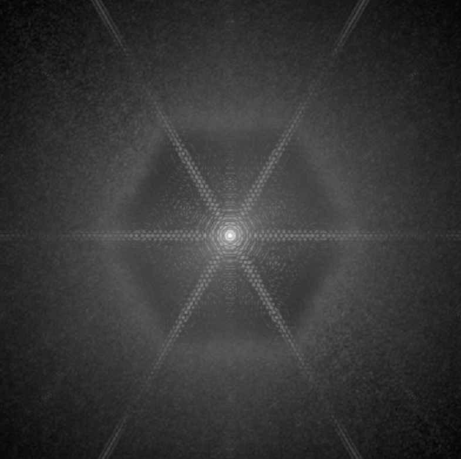{:width="300px"}
The output of a classical COMPASS simulation is the PSF of the simulated system. It is computed as the Fourier transform of the complex field amplitude obtained after a ray-tracing through the turbulent layer screens and the DM shape screen. The wavelength of this PSF is a user parameter; the phase is scaled accordingly. The size of the support for achieving the FFT is chosen among the integer powers of 2 immediately greater than twice the pupil size, in order to provide the user with an adequate sampling of the PSF (in general slightly finer than Nyquist).
The PSF intensity is normalized in such a way that its maximum value corresponds to the Strehl ratio. Each loop iteration produces a short-exposure PSF, which is averaged over the iterations to produce the long-exposure PSF. As it results from a Monte-Carlo simulation, the PSF includes the statistical non convergence limitation.

The user also has the ability to change the pupil just for PSF computation as shown above. It is useful for example to study the impact of spiders on the PSF without including side effects as differential piston in the AO loop.
 
## 3. The shesha package

### 1. COMPASS architecture
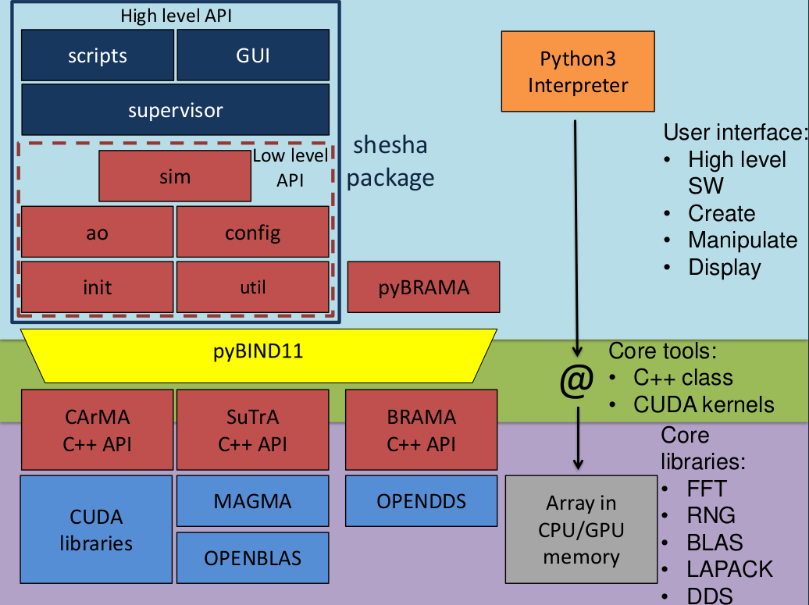{:height="280px"}
The initial objective behind the development of COMPASS was to get a numerical simulation platform able to deliver short exposure PSF (i.e. per WFS frame) with a time-to-solution in the range of the 10th of seconds for an AO system at the E-ELT scale. To reach such performance, the use of GPU as hardware accelerators appeared as the best option.

A comprehensive software stack has been designed to provide at the same time, both high performance computing, brought by core massively parallel algorithms running on GPU and ease of use, brought by a user interface based on python and a graphics toolkit. 

The stack is composed of three main layers. The lowest level is where the optimized libraries are located and in which the memory allocation routines can be found. The intermediate layer is a binding layer, where the arrays in memory are manipulated through addresses. The upper layer is the user interface in which python code interacts with the lower level classes and methods. A number of high level routines can also be found in the upper layer, mostly for initialisation and AO loop data post-processing. All of these layers are composed of libraries and modules that are described in the following section.

On top of this standard stack, a programming interface (API) is available in python to run command-line or scripted simulations and a collection of widgets for an easy-to-use GUI is available, based on the use of the Qt toolkit and the pyQtGraph library. On the other hand, the platform uses the HDF5 file format to maintain a database of simulation parameters and results, which is managed using the Pandas tool. The diagnosis of the results of the simulation can be optimized using the Bokeh tool. Finally, the documentation for the platform is generated automatically using the Sphynx tool.

**Only the shesha package source code is distributed on GitHub. The deeper layers are provided as binaries via conda environment. This configuration already gives to users the possibility to change the behaviour of COMPASS (via hacking/contributing to the shesha package). Users who want to contribute to the core layers for their applications are invited to contact the COMPASS team via the GitHub project.** 

### 2. shesha_config: parameter classes
We describe here all the parameters used in COMPASS and all the classes attributes that could be retrieved by the user during or after the simulation. The following tables give, for each class, the attribute name, a boolean that says if this attribute is settable in the parameters file, its default value and its unit. <span style="color:red"> Parameters displayed in red </span> need to be set by the user in the parameter file if its associated class is instantiated.

#### Param_loop

| Attribute name                              | Type  | Units   | Settable | Default | Comments                        |
| :------------------------------------------ | :---- | :------ | :------- | :------ | :------------------------------ |
| <span style="color:red"> **ittime** </span> | float | seconds | required |         | Loop iteration time             |
| **niter**                                   | int   | frames  | yes      | 0       | Number of iterations to perform |
| **devices**                                 | list  | none    | yes      | [0]     | List of GPU devices to use      |

#### Param_geom

| Attribute name   | Type  | Units   | Settable | Default | Comments                                                                                        |
| :--------------- | :---- | :------ | :------- | :------ | :---------------------------------------------------------------------------------------------- |
| **pupdiam**      | int   | pixels  | yes      |         | Pupil diameter in pixels                                                                        |
| **zenithangle**  | float | degree  | yes      | 0       | Zenithal angle                                                                                  |
| *_ipupil*        | array | none    | no       |         | Pupil in the full size support                                                                  |
| *_mpupil*        | array | none    | no       |         | Pupil in the medium size support                                                                |
| *_spupil*        | array | none    | no       |         | Pupil in the small size support (equal to pupdiam)                                              |
| *_n*             | int   | pixels  | no       |         | Size of _mpupil support                                                                         |
| *ssize*          | int   | pixels  | no       |         | Size of the _ipupil support                                                                     |
| *_n1*            | int   | pixels  | no       |         | Coordinate of the left side of _mpupil in the _ipupil support                                   |
| *_n2*            | int   | pixels  | no       |         | Coordinate of the left side of _mpupil in the _ipupil support                                   |
| *_p1*            | int   | pixels  | no       |         | Coordinate of the left side of _spupil in the _ipupil support                                   |
| *_p2*            | int   | pixels  | no       |         | Coordinate of the left side of _spupil in the _ipupil support                                   |
| *_cent*          | float | none    | no       |         | Center point of the simulation                                                                  |
| *_phase_ab_M1*   | array | microns | no       |         | Phase aberration in _spupil (will be used if referr, std_piston or std_tt are set in Param_tel) |
| *_phase_ab_M1_m* | array | microns | no       |         | Phase aberration in _mpupil (will be used if referr, std_piston or std_tt are set in Param_tel) |

#### Param_tel

| Attribute name                            | Type   | Units         | Settable | Default   | Comments                                                                                                                       |
| :---------------------------------------- | :----- | :------------ | :------- | :-------- | :----------------------------------------------------------------------------------------------------------------------------- |
| <span style="color:red"> **diam** </span> | float  | meters        | required |           | Telescope diameter                                                                                                             |
| **cobs**                                  | float  | ratio of diam | yes      | 0         | Central obstruction size                                                                                                       |
| **type_ap**                               | string | none          | yes      | "generic" | Aperture type available : "generic" (ie. round pupil), "EELT_NOMINAL", "EELT_BP1", "EELT_BP3, "EELT_BP5", "EELT_CUSTOM", "VLT" |
| **spiders_type**                          | string | none          | yes      | None      | Spiders type: "four" or "six"                                                                                                  |
| **t_spiders**                             | float  | ratio of diam | yes      | 0         | Spiders size                                                                                                                   |
| **pupangle**                              | float  | degree        | yes      | 0         | Pupil rotation angle                                                                                                           |
| **nbrmissing**                            | int    | none          | yes      | 0         | Number of missing segments for ELT pupil                                                                                       |
| **referr**                                | float  |               | yes      | 0         | std of reflectivity errors for ELT pupil segments                                                                              |
| **std_piston**                            | float  | microns       | yes      | 0         | std of piston error for ELT pupil segments                                                                                     |
| **std_tt**                                | float  | microns       | yes      | 0         | std of tip-tilt errors for ELT pupil segments                                                                                  |

#### Param_atmos

| Attribute name                                 | Type  | Units    | Settable | Default           | Comments                          |
| :--------------------------------------------- | :---- | :------- | :------- | :---------------- | :-------------------------------- |
| <span style="color:red"> **nscreens** </span>  | int   | none     | required |                   | Number of layers                  |
| <span style="color:red"> **r0** </span>        | float | meters   | required |                   | Fried parameters @ 500 nm         |
| <span style="color:red"> **alt** </span>       | list  | meters   | required |                   | Layers altitudes                  |
| <span style="color:red"> **L0** </span>        | list  | meters   | required |                   | Layers outer scale                |
| <span style="color:red"> **frac** </span>      | list  | fraction | required |                   | Layers fraction of r0             |
| <span style="color:red"> **winddir** </span>   | list  | degree   | required |                   | Wind direction for each layer     |
| <span style="color:red"> **windspeed** </span> | list  | m/s      | required |                   | Wind speed for each layer         |
| **seeds**                                      | list  | none     | yes      | 1234+layer indice | RNG seeds for each layer          |
| *_deltax*                                      | list  | pix/iter | no       |                   | X translation speed of each layer |
| *_deltay*                                      | list  | pix/iter | no       |                   | Y translation speed of each layer |
| *_dim_screens*                                 | list  | pixels   | no       |                   | Size of each layer screen         |
| *_pupixsize*                                   | float | meters   | no       |                   | Layer screens pixel size          |

#### Param_target

| Attribute name                                | Type  | Units   | Settable | Default | Comments                              |
| :-------------------------------------------- | :---- | :------ | :------- | :------ | :------------------------------------ |
| <span style="color:red"> **ntargets** </span> | int   | none    | required |         | Number of targets                     |
| <span style="color:red"> **Lambda** </span>   | list  | microns | required |         | Wavelength for each target            |
| <span style="color:red"> **xpos** </span>     | list  | arcsec  | required |         | X position of each target in the FoV  |
| <span style="color:red"> **ypos** </span>     | list  | arcsec  | required |         | Y position of each target in the FoV  |
| <span style="color:red"> **mag** </span>      | list  |         | required |         | Magnitude of each target              |
| **zerop**                                     | float | degree  | yes      | 1       | Flux for magnitude 0                  |
| **dms_seens**                                 | list  | none    | yes      | all DMs | List of DM indices seen by the target |

#### Param_wfs

| Attribute name                                     | Type   | Units             | Settable | Default | Comments                                                                                         |
| :------------------------------------------------- | :----- | :---------------- | :------- | :------ | :----------------------------------------------------------------------------------------------- |
| <span style="color:red"> **type** </span>          | string | none              | required |         | Type of WFS : "sh" or "pyrhr"                                                                    |
| <span style="color:red"> **nxsub** </span>         | int    | none              | required |         | Number of subaperture along the pupil diameter                                                   |
| <span style="color:red"> **npix** </span>          | int    | pixels            | required |         | Number of pixels per subaperture                                                                 |
| <span style="color:red"> **pixsize** </span>       | float  | arcsec            | required |         | Pixel size                                                                                       |
| <span style="color:red"> **Lambda** </span>        | float  | microns           | required |         | Wavelength                                                                                       |
| <span style="color:red"> **optthroughput** </span> | float  |                   | required |         | Optiical throughput coefficient                                                                  |
| <span style="color:red"> **fracsub** </span>       | float  |                   | required |         | Minimal illumination fraction for valid subap.                                                   |
| <span style="color:red"> **xpos** </span>          | float  | arcsec            | required |         | X position of the guide star in the FoV                                                          |
| <span style="color:red"> **ypos** </span>          | float  | arcsec            | required |         | Y position of the guide star in the FoV                                                          |
| <span style="color:red"> **gsmag** </span>         | float  |                   | required |         | Guide star magnitude                                                                             |
| <span style="color:red"> **zerop** </span>         | float  | photons/m²/s      | required |         | Zero point in the bandwidth of the WFS                                                           |
| <span style="color:red"> **noise** </span>         | float  | electrons         | required |         | Std of electronic noise. If <0, no noise, if =0 photon noise enabled, if >0 add electronic noise |
| <span style="color:red"> **pyr_ampl** </span>      | float  | units of lambda/D | required |         | Pyramid modulation amplitude (pyramid only)                                                      |
| <span style="color:red"> **pyr_npts** </span>      | int    | none              | required |         | Number of modulation point along the circle                                                      |
| **openloop**                                       | bool   | none              | yes      | False   | If True, the WFS don't see the DMs                                                               |
| **fstop**                                          | string | none              | yes      | "none"  | Field stop : "square", "round" or "none"                                                         |
| **fssize**                                         | float  | arcsec            | yes      | 0       | Size of the field stop                                                                           |
| **atmos_seen**                                     | bool   | none              | yes      | False   | If False, the WFS don't see the atmosphere layers                                                |
| **dms_seen**                                       | list   | none              | yes      | All DMs | Indices of DMs seen by the WFS                                                                   |
| **gsalt**                                          | float  | meters            | yes      | 0       | Guide star altitude: 0 for NGS, >0 for LGS                                                       |
| **lltx**                                           | float  | meters            | yes      | 0       | X position of the laser launch telescope                                                         |
| **llty**                                           | float  | meters            | yes      | 0       | Y position of the laser launch telescope                                                         |
| **laserpower**                                     | float  | Watts             | yes      | 0       | Laser power                                                                                      |
| **lgsreturnperwatt**                               | float  | ph/cm²/s/W        | yes      | 0       | Return per watt factor                                                                           |
| **proftype**                                       | string | none              | yes      | "gauss" | Sodium profile type: "gauss" or " Exp"                                                           |
| **beamsize**                                       | float  | arcsec            | yes      |         | laser beam FWHM                                                                                  |
| **G**                                              | float  | none              | yes      | 1       | Magnifying factor (for misalignment)                                                             |
| **thetaML**                                        | float  | degree            | yes      | 0       | WFS rotation angle in the pupil                                                                  |
| **dx**                                             | float  | pixels            | yes      | 0       | X axis misalignment                                                                              |
| **dy**                                             | float  | pixels            | yes      | 0       | Y axis misalignment                                                                              |
| **pyr_pos**                                        | array  |                   | yes      |         | positions for modulation points. Overwrite pyr_ampl and pyr_npts                                 |
| **pyr_loc**                                        | string |                   | yes      | "after" | Location of the modulation, "before" or "after" the field stop                                   |
| **pyr_pup_sep**                                    | int    |                   | yes      | nxsub   | Pyramid pupils separation                                                                        |
| *_pdiam*                                           | int    | pixels            | no       |         | Subap. diameter                                                                                  |
| *_Nftt*                                            | int    | pixels            | no       |         | Size of FFT support                                                                              |
| *_Ntot*                                            | int    | pixels            | no       |         | Size of high resolution support                                                                  |
| *_nrebin*                                          | int    |                   | no       |         | Rebin factor from HR image to final one                                                          |
| *_nvalid*                                          | int    |                   | no       |         | Number of valid subap.                                                                           |
| *_nphotons*                                        | float  | photons           | no       |         | Number of photons per subap. (or total number for a pyramid)                                     |
| *_nphotons4imat*                                   | float  | photons           | no       | 1e5     | Number of photons per subap when doing imat                                                      |
| *_subapd*                                          | float  | meters            | no       |         | Subap. diameter                                                                                  |
| *_fluxPerSub*                                      | array  |                   | no       |         | Fraction of _nphotons for each subap.                                                            |
| *_qpixsize*                                        | float  | arcsec            | no       |         | Quantum pixel size                                                                               |
| *_istart*                                          | array  | pixels            | no       |         | X position of the bottom left corner of each subap. in the _spupil support (1-indexed)           |
| *_jstart*                                          | array  | pixels            | no       |         | Y position of the bottom left corner of each subap. in the _spupil support (1-indexed)           |
| *_validsubsx*                                      | array  |                   | no       |         | X indices of valid subap.                                                                        |
| *_validsubsy*                                      | array  |                   | no       |         | Y indices of valid subap.                                                                        |
| *_isvalid*                                         | array  |                   | no       |         | Array of 0 or 1 for valid subap.                                                                 |
| *_phasemap*                                        | array  |                   | no       |         | Transform from phase screen to subap. screen                                                     |
| *_hrmap*                                           | array  |                   | no       |         |                                                                                                  |
| *_sincar*                                          | array  |                   | no       |         |                                                                                                  |
| *_binmap*                                          | array  |                   | no       |         | Transform from HR image to binned image                                                          |
| *_halfxy*                                          | array  |                   | no       |         | Phase offset of 0.5 pixel shift (SH) or pyramid function (pyrhr)                                 |
| *_submask*                                         | array  |                   | no       |         | Field stop for each subap.                                                                       |
| *_lgskern*                                         | array  |                   | no       |         | LGS kernel convolution                                                                           |
| *_profna*                                          | array  |                   | no       |         | Sodium profile                                                                                   |
| *_altna*                                           | array  | meters            | no       |         | Corresponding altitude                                                                           |
| *_prof1d*                                          | array  |                   | no       |         | HR profile                                                                                       |
| *_profcum*                                         | array  |                   | no       |         | Cumulated HR profile                                                                             |
| *_beam*                                            | array  |                   | no       |         | 1D beam function                                                                                 |
| *_ftbeam*                                          | array  |                   | no       |         | 1D beam function FFT                                                                             |
| *_azimuth*                                         | array  |                   | no       |         | Rotation angle for each spot                                                                     |
| *_pyr_cx*                                          | array  | arcsec            | no       |         | X position of the modulation points                                                              |
| *_pyr_cy*                                          | array  | arcsec            | no       |         | Y position of the modulation points                                                              |

#### Param_dm


| Attribute name                              | Type   | Units                                    | Settable | Default   | Comments                                                                                                      |
| :------------------------------------------ | :----- | :--------------------------------------- | :------- | :-------- | :------------------------------------------------------------------------------------------------------------ |
| <span style="color:red"> **type** </span>   | string | none                                     | required |           | DM type: "pzt", "kl" or "tt"                                                                                  |
| <span style="color:red"> **nact** </span>   | int    | none                                     | required |           | Number of actuators along the diameter   ("pzt" only)                                                         |
| <span style="color:red"> **nkl** </span>    | int    | none                                     | required |           | Number of KL modes produced by the DM  ("kl" only)                                                            |
| <span style="color:red"> **alt** </span>    | float  | meters                                   | required |           | Conjugation altitude                                                                                          |
| <span style="color:red"> **thresh** </span> | float  | fraction                                 | required |           | Threshold on response for selection of valid actuators. Expressed in fraction of the maximal response         |
| **type_pattern**                            | string | none                                     | yes      | "square"  | Actuators position pattern: "square" or "hexa"                                                                |
| **influType**                               | string | none                                     | yes      | "default" | Influence function to use: "default", "radialSchwartz", "squareSchwartz", "blacknutt", "gaussian" or "bessel" |
| **file_influ_hdf5**                         | string | none                                     | yes      | None      | HDF5 file name of custom influence functions. Overwrites influType, type_pattern, nact                        |
| **center_name**                             | string | none                                     | yes      | None      | Column name in the HDF5 pandaDataFrame where the center is stored                                             |
| **cube_name**                               | string | none                                     | yes      | None      | Column name in the HDF5 pandaDataFrame where the influence function cube is stored                            |
| **x_name**                                  | string | none                                     | yes      | None      | Column name in the HDF5 pandaDataFrame where the actuators X coordinates are stored                           |
| **y_name**                                  | string | none                                     | yes      | None      | Column name in the HDF5 pandaDataFrame where the actuators Y coordinates are stored                           |
| **influ_res**                               | string | none                                     | yes      | None      | Column name in the HDF5 pandaDataFrame where the influence functions resolution is stored                     |
| **diam_dm**                                 | string | none                                     | yes      | None      | Column name in the HDF5 pandaDataFrame where the DM diameter is stored                                        |
| **diam_dm_proj**                            | string | none                                     | yes      | None      | Column name in the HDF5 pandaDataFrame where the DM diameter in the pupil plane is stored                     |
| **coupling**                                | float  | fraction                                 | yes      | 0.2       | Coupling between actuators                                                                                    |
| **gain**                                    | float  | none                                     | yes      | 1         | Actuator gain                                                                                                 |
| **unitpervolt**                             | float  | microns/volt ("pzt"), arcsec/volt ("tt") | yes      | 0.01      | Influence function sensitivity                                                                                |
| **push4imat**                               | float  | volt                                     | yes      | 1         | Nominal voltage for imat                                                                                      |
| **margin_out**                              | float  | pitch                                    | yes      | 0         | Outer margin for actuator selection on the pupil edge                                                         |
| **margin_int**                              | float  | pitch                                    | yes      | 0         | Inner margin for actuator selection in the central obstruction                                                |
| **pzt_extent**                              | float  | pitch                                    | yes      | 5         | "pzt" DM extension                                                                                            |
| *_pitch*                                    | float  | pixels                                   | no       |           | Inter actuator space ("pzt" only)                                                                             |
| *_ntotact*                                  | int    | none                                     | no       |           | Total number of valid actuators                                                                               |
| *_influsize*                                | int    | none                                     | no       |           | Influence function support size                                                                               |
| *_n1*                                       | int    | none                                     | no       |           | Left border position of the DM support in _ipupil                                                             |
| *_n2*                                       | int    | none                                     | no       |           | Right border position of the DM support in _ipupil                                                            |
| *_influ*                                    | cube   | none                                     | no       |           | Influence functions cube                                                                                      |
| *_xpos*                                     | array  | none                                     | no       |           | X coordinates of the actuators in _ipupil                                                                     |
| *_ypos*                                     | array  | none                                     | no       |           | Y coordinates of the actuators in _ipupil                                                                     |
| *_i1*                                       | array  | none                                     | no       |           | X coordinates of the bottom left corner of each influence function support in the DM support                  |
| *_j1*                                       | array  | none                                     | no       |           | Y coordinates of the bottom left corner of each influence function support in the DM support                  |
| *_influpos*                                 | cube   | none                                     | no       |           | Influence functions pixels that contributes to each DM pixel                                                  |
| *_ninflu*                                   | array  | none                                     | no       |           | Number of influence functions pixels that contributes to each DM pixel                                        |
| *_influstart*                               | array  | none                                     | no       |           | Index where to start a new DM pixel shape in the array influpos to each DM pixel                              |
| *_nr*                                       | int    | none                                     | no       |           | Number of radial points (KL only)                                                                             |
| *_npp*                                      | int    | none                                     | no       |           | Number of elements (KL only)                                                                                  |
| *_ord*                                      | array  | none                                     | no       |           | Radial orders (KL only)                                                                                       |
| *_rabas*                                    | array  | none                                     | no       |           | Radial array (KL only)                                                                                        |
| *_azbas*                                    | array  | none                                     | no       |           | Azimuthal array (KL only)                                                                                     |
| *_ncp*                                      | int    | none                                     | no       |           | Grid dimension (KL only)                                                                                      |
| *_cr*                                       | array  | none                                     | no       |           | Radial coordinates in cartesian grid (KL only)                                                                |
| *_cp*                                       | array  | none                                     | no       |           | Phi coordinates in cartesian grid (KL only)                                                                   |

#### Param_centroider

| Attribute name                            | Type   | Units  | Settable | Default | Comments                                                                                                       |
| :---------------------------------------- | :----- | :----- | :------- | :------ | :------------------------------------------------------------------------------------------------------------- |
| <span style="color:red"> **type** </span> | string | none   | required |         | Centroider type: "cog", "tcog", "wcog", "bpcog", "corr" or "pyr"                                               |
| <span style="color:red"> **nwfs** </span> | int    | none   | required |         | WFS index handled by this centroider                                                                           |
| <span style="color:red"> **nmax** </span> | int    | none   | required |         | Number of brightest pixels ("bpcog" only)                                                                      |
| *weights*                                 | array  | none   | yes      |         | Weights applied for a "wcog"                                                                                   |
| *thresh*                                  | float  | arcsec | yes      |         | Absolute threshold for "tcog"                                                                                  |
| *type_fct*                                | string | none   | yes      | "gauss" | Reference function for weights computing ("wcog") : "gauss" or "model"                                         |
| *width*                                   | float  |        | yes      |         | Gaussian width if type_fct = "gauss"                                                                           |
| *method*                                  | int    | none   | yes      | 1       | Method used for pyramid centroider. 0: no sinus, global. 1: sinus, global. 2: no sinus, local, 3: sinus, local |
| *sizex*                                   | int    | none   | yes      |         | X size of the interpolation matrix for correlation                                                             |
| *sizey*                                   | int    | none   | yes      |         | Y size of the interpolation matrix for correlation                                                             |
| *interpmat*                               | array  | none   | yes      |         | Interpolation matrix for correlation centroider                                                                |

#### Param_controller

| Attribute name                                   | Type   | Units | Settable | Default | Comments                                                                   |
| :----------------------------------------------- | :----- | :---- | :------- | :------ | :------------------------------------------------------------------------- |
| <span style="color:red"> **type** </span>        | string | none  | required |         | Controller type: "ls", "mv", "cured", "geo" or "generic"                   |
| <span style="color:red"> **nwfs** </span>        | list   | none  | required |         | WFS indices handled by this controller                                     |
| <span style="color:red"> **ndm** </span>         | list   | none  | required |         | DM indices handled by this controller                                      |
| <span style="color:red"> **maxcond** </span>     | float  | none  | required |         | Conditioning number for imat.T.dot(imat) inversion                         |
| <span style="color:red"> **delay** </span>       | float  | frame | required |         | Loop delay                                                                 |
| <span style="color:red"> **gain** </span>        | float  | none  | required |         | Loop gain                                                                  |
| <span style="color:red"> **cured_ndivs** </span> | int    | none  | yes      |         | Subdivision levels for CuReD                                               |
| **modopti**                                      | bool   | none  | yes      | False   | Flag for modal optimization ("ls" only)                                    |
| **nrec**                                         | int    | none  | yes      | 2048    | Number of open loop samples for modal optimization computation ("ls" only) |
| **nmodes**                                       | int    | none  | yes      | ntotact | Number of modes taken into account for modal optimization ("ls" only)      |
| **gmin**                                         | float  | none  | yes      | 0       | Minimum gain for modal optimization ("ls" only)                            |
| **gmax**                                         | float  | none  | yes      | 1       | Maximum gain for modal optimization ("ls" only)                            |
| **ngain**                                        | int    | none  | yes      | 15      | Number of gains to test between gmin and gmax ("ls" only)                  |
| *_nvalid*                                        | list   | none  | no       |         | Number of valid subap. per WFS                                             |
| *_nactu*                                         | int    | none  | no       |         | Number of actuators per DM                                                 |
| *_imat*                                          | array  | none  | no       |         | Interaction matrix                                                         |
| *_cmat*                                          | array  | none  | no       |         | Command matrix                                                             |

### 3. shesha_sim: Simulator class
This module defines the Simulator class that acts as a layer of abstraction for simulation scripts. The attributes of this class are the various objects defined during the initialization phase : 

| Attribute name     | Type         | Description                             |
| :----------------- | :----------- | :-------------------------------------- |
| **atm**            | Atmos        | Atmosphere GPU object                   |
| **tel**            | Telescope    | Telescope GPU object                    |
| **tar**            | Target       | Target GPU object                       |
| **rtc**            | Rtc          | RTC GPU object                          |
| **wfs**            | Sensors      | Sensors GPU object                      |
| **dms**            | Dms          | DMs GPU object                          |
| **config**         | ModuleType   | Parameters imported from your paramfile |
| **c**              | naga_context | GPU context                             |
| **is_init**        | bool         | Flag for completed initialization       |
| **loaded**         | bool         | Flag for loaded parameters              |
| **iter**           | int          | Number of iterations performed          |
| **use_DB**         | bool         | Flag for using the database system      |
| **matricesToLoad** | dict         | Dictionary of teh database              |

Then, those objects can be manipulated through this class. The AO loop process is also embedded in a class method, making user script light and easy to write.

The Simulator class can be instantiated without argument:

```python
import shesha_sim
sim = shesha_sim.Simulator()
```

or with the path to a parameter file : 

```python
import shesha_sim
sim = shesha_sim.Simulator("/path_to_file/param_file.py")
```
 If the path is defined, the file is directly loaded during the instantiation. In the other case, the user has to manually load the file thanks to the function ```load_from_file```: 
 
 ```python
 sim.load_from_file("/path_to_file/param_file.py")
 ```

 Then, the simulation is initialized through a call to the function ```init_sim```:
 
 ```python
 sim.init_sim()
 ```

The initialization process is described below.
{:width="840px"}
Each step of this initialization process depends on the parameters file. For example, if no DM parameters are defined in the parameter file, then no DM will be initialized and the simulation will run without any DM.

After this initialization phase, you can run the AO loop with function ```loop``` that takes the number of iterations as argument:

```
sim.loop(sim.config.p_loop.niter)
```
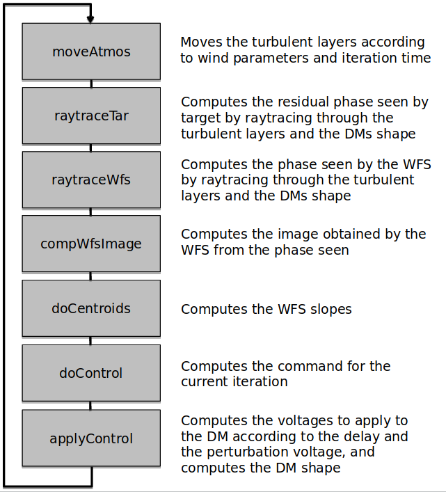{:width="480px"}

Note that ```sim.config.p_loop.niter``` is used to retieve the number of iterations specified in the parameter file : you can replace it by any integer.

The AO loop process is also depicted. Note that, due to this process order, there is an inherent 1-frame delay. So if the delay parameter is set to 1 in the parameter file, the simulated delay will be a 2-frames delay.
Note that the PSF is not computed at each iteration. By default, it will be computed each 100 iterations by the command ```tar.comp_image(0)``` in the ```loop``` function. If this behaviour doesn't fulfill your requirements, please refer to the section [Scripting with COMPASS](#4-scripting-with-compass).

Details on the Simulator class functions can be found in [the shesha documentation](http://shesha.readthedocs.io/en/master/shesha_sim.html).

#### Database management
The initialization step can be accelerated by re-using previous results from older simulations runs, as phase screens or interaction matrix. To use this feature, you have to instantiate the Simulator with ```use_DB=True```:
```python
import shesha_sim
sim = shesha_sim.Simulator("/path_to_file/param_file.py", use_DB=True)
```
At first use, it will create ```$SHESHA_ROOT/data/matricesDataBase.h5``` file where we store all the arrays used to create phase screens, DMs and interaction matrix. The parameters of the simulation are also saved. Then, each time you run a simulation, COMPASS check in this file if some of those arrays can be re-used according to the parameters of your simulation. If it is possible, it will just load those arrays, leading to an acceleration of the initialization phase. In the other case, it will compute normally those arrays and store them in the database.

**Note :** *We have already encounter some stability problems of the database system. If it occurs, we suggest to remove the ```$SHESHA_ROOT/data/matricesDataBase.h5``` file and all the ```.h5``` files created by the database. This can be done by using the shell script ```$SHESHA_ROOT/cleanDB.sh```.*

## 4. Scripting with COMPASS
This section aims to provide some tips for writing your own script. We higly recommend to create your own class that inherits from the Simulator class for obvious convenience reasons. Once you have created your own class, just write a python script that will use it properly.
### 1. Inheritance
You don't know anything about inheritance with python, you can find information in the [Python documentation](https://docs.python.org/3/tutorial/classes.html#inheritance).

We recommend to not overwrite the ```init_sim```, ```load_from_file``` and ```force_context``` functions in your class, unless you really know what you are doing. The interesting function the overwrite are ```next``` and eventually ```loop```.

The ```next``` function defines what happen during an iteration. You can basically rewrite this function if you want a specific behaviour for your loop.

The ```loop``` function basically put the ```next``` function in a loop and performs some operations like PSF computation regularly.

By overwriting those two functions in your own class, you can reach any wanted behaviour for your simulation.

### 2. Batch processing
Once you have wrote your script and tested it, you will probably want to perform a batch of simulations for parameters space exploration.

To do so, we highly recommend to write your batch script as a shell script that will call your python script. Indeed, we have noticed some unexpected problems by performing a high number of simulation in an unique python session. A bash script allows then to close the python session at the end of a simulation and to opena new one for the next simulation, ensuring then correct results.

We recommend to use [docopt](http://docopt.org/) in your python file to easily parse arguments from the shell in your script. This tip will avoid you to write a parameter file per simulation case. Your python script will also have to include a function that will save the results of each simulations.

**Example: performing simulations for various r0**

- **Step 1**: write your parameter file 
- **Step 2**: write your own class that inherits from Simulator to perform whatever you want during the simulation process
- **Step3**: write your script using docopt. Here, we want to get r0 as a command line argument. The script should be like:

```python
"""script for my simulation

Usage:
  my_script.py <parameters_filename> <save_filename> [options]

with 'parameters_filename' the path to the parameters file

Options:
  -h --help                   Show this help message and exit
  --r0 r0                     set the r0
"""

from docopt import docopt 
from YourFile import YourClass

arguments = docopt(__doc__)
param_file = arguments["<parameters_filename>"]
save_file = arguments["<save_filemane>"]

sim = YourClass(param_file) # Instantiates your class and load parameters

if arguments["--r0"]: # Check if r0 has been given as arguments
    sim.config.p_atmos.set_r0(float(arguments["--r0"])) # Change the r0 before initalization

sim.init_sim()
sim.loop()

a_save_function(save_file)
```
- **Step 4**: write a shell script

```bash
#!/bin/bash
R0="0.12 0.14 0.16 0.18"
script="/path_to_your_script/my_script.py"
savepath="/path_where_to_save"
OUTPUT="/path/logfile.log"

for r in $R0
do
    CMD="python $script $savepath/sim_with_r0_"$r".h5 -- --r0 $r"
    echo "execute $CMD" >> $OUTPUT
    $CMD 2>> $OUTPUT >> $OUTPUT
done
```


